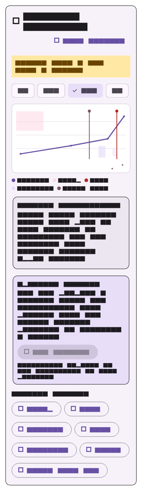

# Context timeline component and deterministic preview

- Status: reusable opt-in Context view component; fixture preview remains
  non-shipping
- Owner: `@shroominic`
- Scope: synchronous snapshot-rendering seam

## Boundary

`CompactContextTimeline` is composed only into the explicitly enabled Context
view. It is not part of the default glucose reader or a Settings screen. The
component has no direct repository, platform, HealthKit, Health Connect,
network, or persistence access. It reads one synchronous
`ContextTimelineSource` snapshot and can emit only an unsaved draft intent to a
receiving feature.

The deterministic fixture preview is collapsed by default. The opt-in Context
view may choose a different expansion state. Neither use replaces the glucose
surface, modifies glucose data, adds a journal record directly, requests a
permission, or makes a medical claim.

## Truth rules

- The selected time window filters every displayed record. A fallback lane
  status becomes **Partial data** only when it has a record in that selected
  window. An upstream source must provide an explicit status when it knows that
  data is unavailable, stale, partial, or conflicting.
- Individual details show their exact local time window, source label, and
  qualification. A mixed-source heart-rate rail lists every represented source;
  it never attributes the entire rail to the newest sample's source.
- The optional attachment prompt is generic. It is not called a glucose rise,
  pattern, explanation, or cause. It lets a receiving feature prepare an
  unsaved draft only. The production add flow is owned outside this visual
  component and is documented in `context-view.md`.
- Sample snapshots carry the visible `SAMPLE DATA — NOT FROM A SENSOR` notice.
  The preview must never imply that sample, imported, stale, partial, or
  inaccessible context is live sensor data.

## Deferred work

The explicit Context view now owns its reviewed bridge snapshot and bounded
candidate policy. Default-reader placement, additional imports, source-priority
rules, and physical-device evidence remain outside this component. The
physical-evidence plan in `context-view.md` is **NOT RUN**.

## Deterministic evidence

`openhealth/test/context_timeline/compact_context_timeline_test.dart` checks
the collapsed state, range/status truth, mixed-source drill-down, generic
non-causal prompt copy, screen-reader labels, compact layouts, and reduced
motion. It also owns the deterministic sample screenshot below:

The golden uses Flutter's deterministic test font, so text is rendered as
redacted blocks. The same widget test asserts the readable semantic labels.
The fixture contains synthetic sample data only; no sensor identifier, person,
or real health record is captured in the image.
